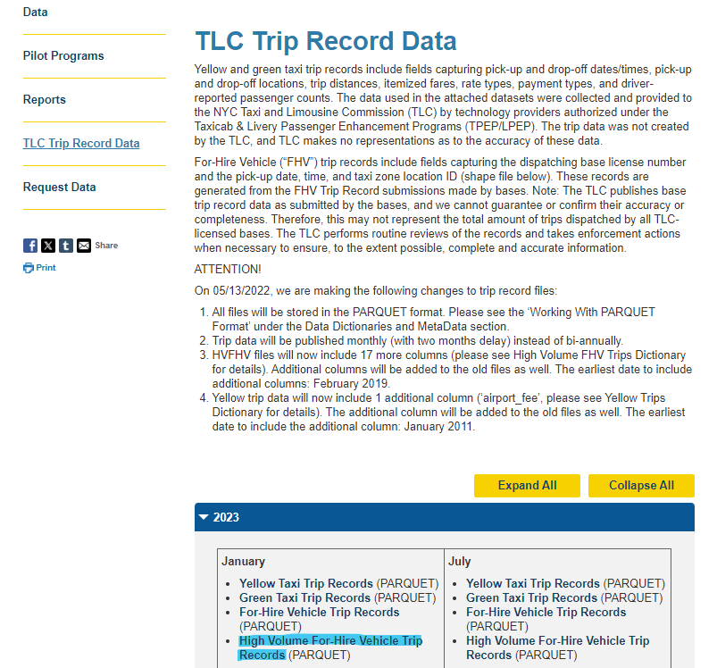

```{r, include = FALSE}
knitr::opts_chunk$set(
  collapse = TRUE,
  comment = "#>",
  fig.path = "man/figures/README-",
  out.width = "100%"
)
```

# project.nyc.taxi

<!-- badges: start -->
<!-- badges: end -->

In this package, you will find the tools needed to reproduce the analysis done in the project to help taxi drivers in NYC implement strategies that can help them increase their earnings.

## Installation

You can install the development version of project.nyc.taxi like so:

``` r
# FILL THIS IN! HOW CAN PEOPLE INSTALL YOUR DEV PACKAGE?
```

## Data used

In this project will use a subset of the data available in the [TLC Trip Record Data](https://www.nyc.gov/site/tlc/about/tlc-trip-record-data.page).

I will focus our attention to the 2022 and 2023 data available on the **High Volume For-Hire Vehicle** as you can see below.



Where each **row represents a single trip** in an FHV  dispatched by one of NYC’s licensed High Volume FHV bases and each column has next meaning based on [data dictionary](https://www.nyc.gov/assets/tlc/downloads/pdf/data_dictionary_trip_records_hvfhs.pdf) avaible on the web page.

|**Field Name**|**Description**|
|:-------------|:--------------|
|**hvfhs_license_num**|The TLC license number of the HVFHS base or business. As of September 2019, the HVFHS licensees are the following: <br> - HV0002: Juno <br> - HV0003: Uber <br> - HV0004: Via <br> - HV0005: Lyft|
|**dispatching_base_num**|The TLC Base License Number of the base that dispatched the trip|
|**originating_base_num**|Base number of the base that received the original trip request|
|**request_datetime**|Date/time when passenger requested to be picked up|
|**on_scene_datetime**|Date/time when driver arrived at the pick-up location (Accessible Vehicles-only)|
|**pickup_datetime**|The date and time of the trip pick-up|
|**dropoff_datetime**|The date and time of the trip drop-off|
|**PULocationID**|TLC Taxi Zone in which the trip began|
|**DOLocationID**|TLC Taxi Zone in which the trip ended|
|**trip_miles**|Total miles for passenger trip|
|**trip_time**|Total time in seconds for passenger trip|
|**base_passenger_fare**|Base passenger fare before tolls, tips, taxes, and fees|
|**tolls**|Total amount of all tolls paid in trip|
|**bcf**|Total amount collected in trip for Black Car Fund|
|**sales_tax**|Total amount collected in trip for NYS sales tax|
|**congestion_surcharge**|Total amount collected in trip for NYS congestion surcharge|
|**airport_fee**|$2.50 for both drop off and pick up at LaGuardia, Newark, and John F. Kennedy airports|
|**tips**|Total amount of tips received from passenger|
|**driver_pay**|Total driver pay (not including tolls or tips and net of commission, surcharges, or taxes)|
|**shared_request_flag**|Did the passenger agree to a shared/pooled ride, regardless of whether they were matched? (Y/N)|
|**shared_match_flag**|Did the passenger share the vehicle with another passenger who booked separately at any point during the trip? (Y/N)|
|**access_a_ride_flag**|Was the trip administered on behalf of the Metropolitan Transportation Authority (MTA)? (Y/N)|
|**wav_request_flag**|Did the passenger request a wheelchair-accessible vehicle (WAV)? (Y/N)|
|**wav_match_flag**|Did the trip occur in a wheelchair-accessible vehicle (WAV)? (Y/N)|

